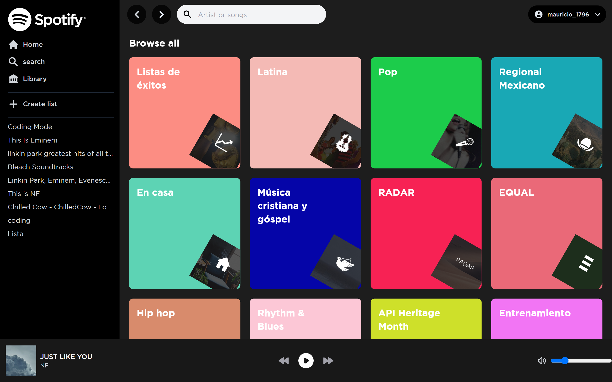

<h1 align="center">Spotify Clone</h1>

<!-- TABLE OF CONTENTS -->

## Table of Contents

- [Overview](#overview)
- [Features](#deploy)
  - [Built With](#built-with)
- [Features](#features)
- [How to use](#how-to-use)
- [Contact](#contact)


<!-- OVERVIEW -->

## Overview

Spotify clone with some of its features implemented.



## Deploy

[Spotify Clone 🚀](https://spotify-clone-1-0-jmauricio22.vercel.app/)


## Built With

<!-- This section should list any major frameworks that you built your project using. Here are a few examples.-->

- [Next](https://nextjs.org/)
- [NextAuth](https://next-auth.js.org/)
- [Tailwind CSS](https://tailwindcss.com/)


## Features

<!-- List the features of your application or follow the template. Don't share the figma file here :) -->

- [x] I can login.
- [x] I can see my playlist.
- [x] I can search for track, album and artist.
- [x] I can play track.
- [x] I can play artist album.
- [x] I can play artist top tracks.
- [x] I can create a new playlist.
- [x] I can follow a playlist.
- [x] I can follow a artist.
- [x] I can to play the next track.
- [x] I can to play the previous track.
- [x] I can adjust the volume.

## How To Use

<!-- Example: -->

```bash

# Clone this repository
$ git clone https://github.com/JMauricio22/spotify-clone-1.0.git

# Install dependencies
$ cd spotify-clone-1.0

# Install dependencies
$ npm install

# Run the api
$ npm run dev
```

## Contact

- GitHub: [JMauricio22](https://github.com/JMauricio22)
- Linkedin: [mauriciolemus](https://www.linkedin.com/in/mauriciolemus/)